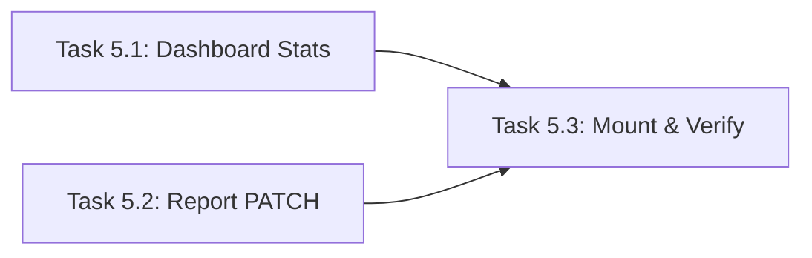

# Master Plan: Admin Routes (Task 05)

> **Lane:** Backend
> **Feature:** Admin Dashboard Stats + Report Management
> **Parent Task:** `Task_05_Admin_Routes.md`
> **Status:** 🆕 Planning

---

## High-Level Architecture

```
GET /api/admin/dashboard
  → reads store.getAllReports()
  → computes aggregate stats (totals, by-category, by-severity, by-department)
  → computes hotspots via location clustering
  → returns APIResponse<AdminDashboardData>

PATCH /api/admin/reports/:id
  → finds report by id in store
  → updates status / assignedTo / updatedAt
  → returns APIResponse<CivicReport>
```

**Data flow:** Both endpoints are read/write operations over the existing in-memory `store.reports[]`. No new types needed — `AdminDashboardData`, `DashboardHotspot`, `CivicReport`, `ReportStatus` already exist in `types/index.ts` (lines 340–359).

---

## Subtask List

| # | Subtask | Target File | Effort |
|---|---|---|---|
| 5.1 | Dashboard Stats Endpoint | `app/src/server/routes/admin.ts` | S |
| 5.2 | Report PATCH Endpoint | `app/src/server/routes/admin.ts` | S |
| 5.3 | Mount & Verify | `app/src/server/index.ts` | S |

---

## Parallelization Guide

> Use **Antigravity Agent Manager** to run independent tasks simultaneously.
> Open one agent session per task in the same lane.

### Dependency Graph


### Execution Waves
| Wave | Tasks (run in parallel) | Model per Task | Notes |
|---|---|---|---|
| Wave 1 | Task 5.1, Task 5.2 | Flash, Flash | Independent — both write to admin.ts but different endpoints |
| Wave 2 | Task 5.3 | Flash | Mount router, run `npm run build`, verify |

### Agent Manager Instructions
1. **Wave 1 option A (recommended):** Run a single agent session that implements both 5.1 and 5.2 sequentially in one file. This avoids merge conflicts since both write to the same file (`admin.ts`).
2. **Wave 1 option B:** If parallelizing, assign 5.1 to write the file scaffold + GET endpoint, and 5.2 to append the PATCH endpoint after 5.1 completes.
3. **Wave 2:** Run Task 5.3 to mount the router and verify build.

---

## Store Helper Needed

The `DataStore` class in `store.ts` needs a `getReportById(id: string)` helper. Task 5.2 should add it if it doesn't exist. Check before adding — if another task already added it, skip.

---

## Key Types Reference

```typescript
// types/index.ts — lines 340-359
AdminDashboardData {
  totalReports, openReports, resolvedToday, averageResolutionHours,
  reportsByCategory, reportsBySeverity, reportsByDepartment,
  recentReports, hotspots
}

DashboardHotspot {
  location: GeoLocation, reportCount, dominantCategory, averageSeverity
}

// types/index.ts — lines 22-28
ReportStatus = 'analyzing' | 'classified' | 'submitted' | 'in_progress' | 'resolved' | 'rejected'
```
