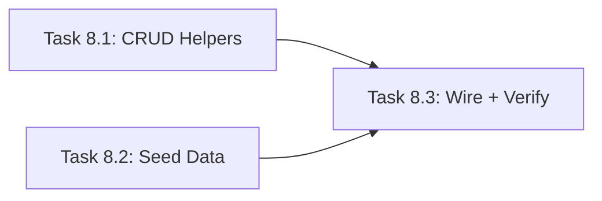

# Master Plan: In-Memory Data Store Completion (Task 08)

> **Lane:** Backend
> **Feature:** Complete the centralized in-memory store to match Task 08 spec
> **Parent Task:** `Task_08_InMemory_Store.md`
> **Status:** ✅ Done (Agent@13:02)

---

## Current State Analysis

The store (`app/src/server/store.ts`) was partially implemented during earlier tasks. It has a `DataStore` class with basic report/listing/conversation arrays and `seedReports()` with 5 mock reports. However, several features from the Task 08 spec are **missing**:

| Required Feature | Status |
|---|---|
| `filterReports({bbox, status, category, severity})` | ❌ Missing |
| `updateReport(id, updates)` with `updatedAt` | ❌ Missing |
| `getActiveListings()` — excludes expired | ❌ Missing |
| `clearConversation(id)` | ❌ Missing |
| 15 mock reports across 9 neighborhoods | ❌ Only 5 exist |
| 8 mock Pazar listings with Dalmatian produce | ❌ Missing entirely |

### Architecture Decision: Augment, Don't Restructure

Task 08 spec suggests `store/dataStore.ts` + `store/index.ts`, but the current flat `store.ts` is already imported by **all existing routes** (`report.ts`, `admin.ts`, `chat.ts`, etc.) and `index.ts`. Restructuring would break every import with zero functional benefit. We will **augment** the existing `store.ts` in-place.

---

## Shared Types (No New Types Needed)

All required types already exist in `app/src/types/index.ts`:
- `CivicReport` (L168–179) — with `GeoLocation` containing `lat`/`lng`
- `PazarListing` (L229–238) — with `isActive`, `expiresAt`
- `ChatMessage` (L118–127)
- `MapBoundingBox` (L590–595) — `north`/`south`/`east`/`west` for bbox filtering

---

## Subtask List

| # | Subtask | Target Files | Effort | Model |
|---|---|---|---|---|
| 8.1 | Add missing CRUD helpers (`filterReports`, `updateReport`, `getActiveListings`, `clearConversation`) | `app/src/server/store.ts` | S | Flash | ✅ |
| 8.2 | Expand seed data: 10 more reports + 8 Pazar listings | `app/src/server/store.ts` | S | Flash | ✅ |
| 8.3 | Wire seed call + verify build | `app/src/server/index.ts` | S | Flash | ✅ |

---

## Parallelization Guide

> Use **Antigravity Agent Manager** to run independent tasks simultaneously.
> Open one agent session per task in the same lane.

### Dependency Graph

### Execution Waves
| Wave | Tasks (run in parallel) | Model per Task | Notes |
|---|---|---|---|
| Wave 1 | Task 8.1, Task 8.2 | Flash, Flash | Independent — 8.1 adds methods, 8.2 adds seed functions. Both touch `store.ts` so **run sequentially if using a single agent**, or split carefully. |
| Wave 2 | Task 8.3 | Flash | Calls new seed function in `index.ts`, runs `npm run build` |

### ⚠️ Single-Agent Recommendation

Since both 8.1 and 8.2 modify the same file (`store.ts`), the safest path is to **run all three sequentially in a single agent session**. Total effort is ~15 minutes. Use `/execute` with a single Flash agent.

### Agent Manager Instructions
1. **Option A (Single agent, recommended):** Run 8.1 → 8.2 → 8.3 sequentially in one session.
2. **Option B (Two agents):** Agent 1 does 8.1, Agent 2 does 8.2 on a copy. Manually merge, then run 8.3.

---

## Key Implementation Notes

1. **`filterReports` signature:** Accept `{ bbox?: MapBoundingBox; status?: ReportStatus; category?: IssueCategory; severity?: SeverityLevel }`. Apply each filter only if the key is present. For bbox, check `report.location.lat` is between `south` and `north`, and `report.location.lng` is between `west` and `east`.
2. **`updateReport` signature:** Accept `(id: string, updates: Partial<Pick<CivicReport, 'status' | 'assignedTo'>>)`. Auto-set `updatedAt = new Date().toISOString()`. Return the updated report or `undefined`.
3. **`getActiveListings`:** Filter by `listing.isActive === true && new Date(listing.expiresAt) > new Date()`.
4. **Seed coordinates:** Use the 9 neighborhoods from the task spec (Varoš, Bačvice, Manuš, Firule, Spinut, Diocletian's Palace, Gripe, Lovret, Lučac). The existing 5 reports cover Varoš, Bačvice, Manuš, Spinut, Diocletian's Palace — add reports for Firule, Gripe, Lovret, Lučac and extras for existing neighborhoods.
5. **Pazar seed data:** 8 listings with Dalmatian produce names (brancin, škampi, blitva, maslinovo ulje, sir paški, rajčice, tikvice, smokve). Set `expiresAt` to 4 hours from creation. Vary freshness based on current hour.
