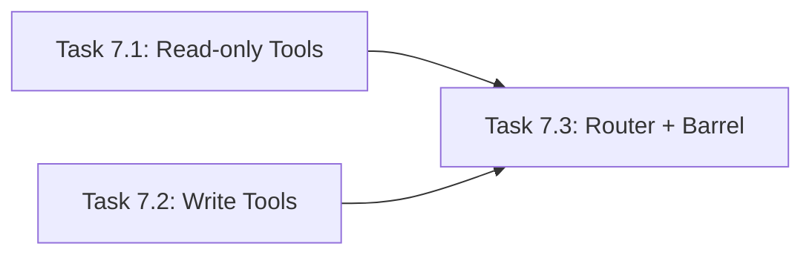

# Master Plan: Mock Tool Implementations (Task 07)

> **Lane:** Backend
> **Feature:** 6 Gemini Function-Call Tools + Tool Router
> **Parent Task:** `Task_07_Mock_Tools.md`
> **Status:** ✅ Done (Agent@14:57)

---

## High-Level Architecture

```
AI Orchestration (AI Lane)
   │
   ▼
executeTool(toolName, args)   ← toolRouter.ts
   │
   ├─► submit_gradsko_oko_report  → store.addReport()    → { ticketId, status, eta }
   ├─► check_parking_availability → parkingData lookup    → { available, zones, price }
   ├─► get_bus_eta                → transitData lookup    → { eta, nextBuses, alerts }
   ├─► get_dir_index              → crowdData lookup      → { crowdLevel, suggestion }
   ├─► submit_pazar_listing       → store.addListing()    → { listingId, expiresAt }
   └─► get_emergency_info         → emergencyData lookup  → { instructions, tips }
```

**Key design decision:** Each tool is a standalone async function `(args) => Promise<Record<string, unknown>>` that mirrors the data patterns already established in the utility routes (`parking.ts`, `transit.ts`, `crowd.ts`, `emergency.ts`, `report.ts`). The tools reuse the same mock data structures but return plain objects (not Express responses) since they are called programmatically by the AI orchestration layer, not by HTTP clients.

### Data Reuse Strategy

| Tool | Reuses Data From | Store Interaction |
|---|---|---|
| `submit_gradsko_oko_report` | `report.ts` patterns | **Write** — `store.addReport()` |
| `check_parking_availability` | `parking.ts` `parkingData` | **Read-only** — local mock data |
| `get_bus_eta` | `transit.ts` schedule data | **Read-only** — local mock data |
| `get_dir_index` | `crowd.ts` area data | **Read-only** — local mock data |
| `submit_pazar_listing` | Pazar types from `types/index.ts` | **Write** — `store.addListing()` |
| `get_emergency_info` | `emergency.ts` instruction data | **Read-only** — local mock data |

---

## Shared Types (No New Types Needed)

All required types already exist in `app/src/types/index.ts`:
- `ParkingInfo` (L290–299), `TransitInfo` (L302–308), `TransitBusArrival` (L311–316)
- `CrowdInfo` (L319–326), `AlternateRoute` (L329–333)
- `EmergencyInfo` (L268–276), `EmergencyContact` (L279–283)
- `CivicReport` (L168–179), `PazarListing` (L229–238)
- `ToolCallResult` (L130–134) — used by AI lane for wiring

**Tool function signature (shared convention):**
```typescript
type ToolHandler = (args: Record<string, unknown>) => Promise<Record<string, unknown>>;
```

---

## Subtask List

| # | Subtask | Target Files | Effort | Model |
|---|---|---|---|---|
| 7.1 | Read-only tools (parking, bus, crowd, emergency) | `tools/checkParking.ts`, `tools/getBusEta.ts`, `tools/getDirIndex.ts`, `tools/getEmergencyInfo.ts` | S | Flash | ✅ |
| 7.2 | Write tools (report submit, pazar listing) | `tools/submitReport.ts`, `tools/submitPazarListing.ts` | S | Flash | ✅ |
| 7.3 | Tool Router + Barrel Export | `tools/toolRouter.ts`, `tools/index.ts` | S | Flash | ✅ |

---

## Parallelization Guide

> Use **Antigravity Agent Manager** to run independent tasks simultaneously.
> Open one agent session per task in the same lane.

### Dependency Graph


### Execution Waves
| Wave | Tasks (run in parallel) | Model per Task | Notes |
|---|---|---|---|
| Wave 1 | Task 7.1, Task 7.2 | Flash, Flash | Independent — different files, no conflicts |
| Wave 2 | Task 7.3 | Flash | Imports all 6 tools, builds `TOOL_REGISTRY` map + `executeTool()` |

### Agent Manager Instructions
1. **Wave 1:** Start **2 agents** — one for Task 7.1 (4 read-only tools), one for Task 7.2 (2 write tools).
2. **Wave 2:** After both complete, start Task 7.3 to create the router and barrel export, then `npm run build`.

---

## Key Implementation Notes

1. **No HTTP layer.** These are NOT Express routes. They are plain async functions called by the AI orchestration layer.
2. **Mirror existing data.** Reuse the same mock data patterns from the utility routes for consistency. Don't invent new data.
3. **Error handling.** Each tool should catch errors and return `{ error: string }` objects rather than throwing, since the AI layer needs to pass errors back to Gemini.
4. **Arg validation.** Each tool should validate required args and return descriptive errors if missing.
5. **Store imports.** Only `submitReport` and `submitPazarListing` import from `store.ts`. The read-only tools have self-contained mock data.
