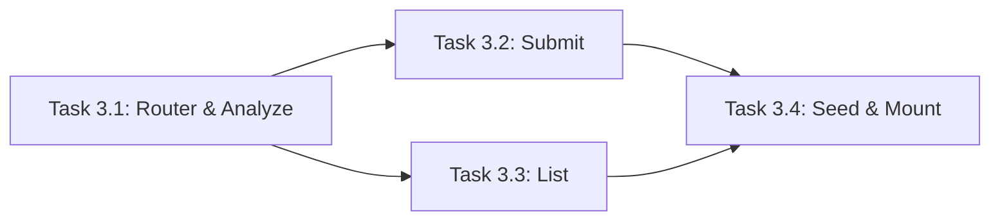

# Master Plan: Report Routes Implementation

> **Objective:** Implement the three report endpoints that power the civic issue photo reporting flow: Analyze (mock), Submit (ticket creation), and List (filtered/spatial search).
> **Lane:** Backend
> **Feature Pillar:** Instant Dashboard Clarity / Effortless Record-Keeping
> **North Star Alignment:** Providing real-time, AI-assisted reporting for Split's citizens.

## Architecture & Data Flow

```mermaid
graph TD
    Client[Frontend / Mobile] -->|POST /api/report/analyze| Analyze[Report Router: /analyze]
    Analyze -->|Mock Logic| AnalyzeRes[Mock Classification]
    
    Client -->|POST /api/report/submit| Submit[Report Router: /submit]
    Submit -->|Generate Ticket| Store[In-Memory Store]
    
    Client -->|GET /api/reports| List[Report Router: /reports]
    List -->|Filter/Bbox| Store
    
    Store -->|Return Reports| ListRes[CivicReport[]]
```

### Shared Data Contracts
All types are defined in `app/src/types/index.ts`. Key interfaces:
- `CivicReport`
- `CivicReportClassification`
- `ReportAnalyzeRequest/Response`
- `ReportSubmitRequest/Response`
- `APIResponse<T>`

## Subtasks organized by execution order

1. **Task 3.1: Report Router & Mock Analyzer (`POST /analyze`)**
   - Create `app/src/server/routes/report.ts`
   - Implement the `/analyze` endpoint with a robust mock classification engine.
2. **Task 3.2: Report Submission & Ticket Generation (`POST /submit`)**
   - Implement the `/submit` endpoint.
   - Logic for `ticketId` generation (`GR-2026-XXXX`).
   - Saving to the in-memory store.
3. **Task 3.3: Reports Listing & Spatial (Bbox) Filtering (`GET /`)**
   - Implement the listing endpoint at `/api/reports`.
   - Complex filtering logic (status, severity, category, department).
   - Spatial filtering using `bbox` query parameter.
4. **Task 3.4: Split Seed Data & Integration**
   - Pre-seed the store with 10-15 realistic reports in Split.
   - Mount the router in `app/src/server/index.ts`.
   - Verify build and basic integration.

## Parallelization Guide

> Use **Antigravity Agent Manager** to run independent tasks simultaneously.

### Dependency Graph


### Execution Waves
| Wave | Tasks (run in parallel) | Model per Task | Notes |
|---|---|---|---|
| Wave 1 | Task 3.1 | Gemini 3.1 Pro High | Initializes the router file |
| Wave 2 | Task 3.2, Task 3.3 | Gemini 3.1 Pro High | Both can work on the router file simultaneously (git merge) |
| Wave 3 | Task 3.4 | Gemini 3.0 Flash | Final integration and data populating |

### Agent Manager Instructions
1. Start **1 agent** for Wave 1 (Task 3.1).
2. Once 3.1 is done and committed, start **2 agents** for Wave 2 (Task 3.2 and Task 3.3).
3. Finally, start **1 agent** for Wave 3 (Task 3.4).

## Model Recommendations

| Task Type | Recommended Model | Planning Mode |
|---|---|---|
| Routing & Logic | Gemini 3.1 Pro High | OFF |
| Complex Filtering | Opus 4.6 | OFF |
| Seed Data | Gemini 3.0 Flash | OFF |
| Integration | Gemini 3.0 Flash | OFF |
