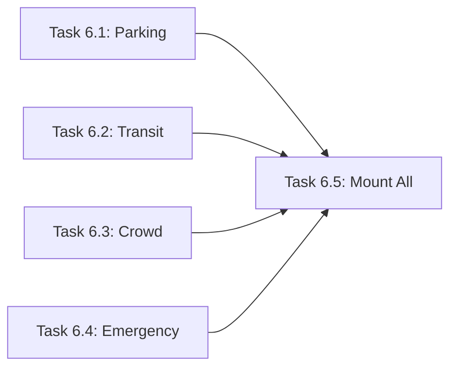

# Master Plan: Utility Routes (Task 06)

> **Lane:** Backend
> **Parent Task:** `Task_06_Utility_Routes.md`
> **Total Subtasks:** 5
> **Estimated Total Effort:** S (<30min total)
> **Status:** ✅ Done (Agent@14:15)

---

## High-Level Architecture

Four lightweight Express routers, each serving hardcoded Split-specific mock data for a single city service domain. These endpoints are consumed by Gemini function calling (Task 07) as tool results.

```
server/routes/
├── parking.ts    → GET /api/parking/:zone    → APIResponse<ParkingInfo>
├── transit.ts    → GET /api/transit/:line     → APIResponse<TransitInfo>
├── crowd.ts      → GET /api/crowd/:area      → APIResponse<CrowdInfo>
└── emergency.ts  → GET /api/emergency/:type  → APIResponse<EmergencyInfo>
```

### Data Flow

```
Frontend/AI → GET /api/{service}/{param} → Express Router → Hardcoded Mock Data → APIResponse<T>
```

No store interaction needed — these are pure stateless mock endpoints.

---

## Shared Contracts (already in `types/index.ts`)

All types are defined and ready. No additions needed:

| Type | Lines | Used By |
|---|---|---|
| `ParkingInfo` | 290–299 | `parking.ts` |
| `TransitInfo`, `TransitBusArrival` | 302–316 | `transit.ts` |
| `CrowdInfo`, `AlternateRoute` | 319–334 | `crowd.ts` |
| `EmergencyInfo`, `EmergencyContact` | 268–283 | `emergency.ts` |
| `CityZone` | 60–68 | `parking.ts` |
| `EmergencyType` | 71–77 | `emergency.ts` |
| `SupportedLanguage` | 16 | `emergency.ts` |
| `APIResponse<T>` | 366–371 | All routes |

---

## Subtask List

| # | Subtask | File | Depends On | Effort |
|---|---|---|---|---|
| 6.1 | Parking Route | `server/routes/parking.ts` | None | XS | ✅ |
| 6.2 | Transit Route | `server/routes/transit.ts` | None | XS | ✅ |
| 6.3 | Crowd Route | `server/routes/crowd.ts` | None | XS | ✅ |
| 6.4 | Emergency Route | `server/routes/emergency.ts` | None | XS | ✅ |
| 6.5 | Mount All Routes | `server/index.ts` | 6.1–6.4 | XS | ✅ |

---

## Parallelization Guide

> Use **Antigravity Agent Manager** to run independent tasks simultaneously.
> Open one agent session per task in the same lane.

### Dependency Graph


### Execution Waves
| Wave | Tasks (run in parallel) | Model per Task | Notes |
|---|---|---|---|
| Wave 1 | Task 6.1, 6.2, 6.3, 6.4 | Gemini 3.0 Flash | All independent — start all 4 simultaneously |
| Wave 2 | Task 6.5 | Gemini 3.0 Flash | Mount in index.ts, verify build |

### Agent Manager Instructions
1. Open Agent Manager in Antigravity IDE
2. Start **4 agents** for Wave 1 — one for each route file (all Gemini 3.0 Flash)
3. Wait for all 4 to complete
4. Start Task 6.5 with Gemini 3.0 Flash to mount and verify build

---

## Pattern Reference

All routes follow the established pattern from `report.ts`:
```typescript
import { Router, Request, Response } from 'express';
import { APIResponse, SomeType } from '../../types/index.js';

const router = Router();

router.get('/:param', (req: Request, res: Response) => {
  try {
    // ... mock data logic
    const response: APIResponse<SomeType> = {
      success: true,
      data: { /* ... */ },
      timestamp: new Date().toISOString(),
    };
    res.json(response);
  } catch (error) {
    res.status(500).json({
      success: false,
      error: { code: 'ERROR_CODE', message: 'Description' },
      timestamp: new Date().toISOString(),
    });
  }
});

export default router;
```
