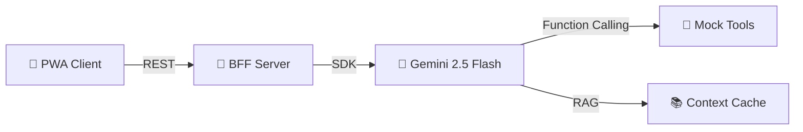

# SplitAI — Master Plan

> **One AI agent for Split: ask anything, report anything, in any language.**
>
> **Last Updated:** 2026-05-16T11:25:00+02:00
> **Phase:** Architecture → Delegation

---

## 1. Overview & Architecture

SplitAI is a **Unified Municipal AI Agent** for the City of Split. It provides a single conversational interface backed by Gemini 2.5 Flash that routes citizen and tourist requests to specialized capabilities: RAG regulation Q&A, Vision-based civic reporting, a daily Pazar market feed, multilingual chat, and an admin triage dashboard.

**Deliverables:**
1. **Brand Website** — Static landing page (Aura template) for judges and marketing
2. **Web Application (PWA)** — React 19 + Vite + TypeScript — primary product
3. **BFF Server** — Express.js proxy protecting Gemini API key, serving mock tools

**Full architecture:** See [`docs/architecture/ARCHITECTURE.md`](../docs/architecture/ARCHITECTURE.md)

---

## 2. Lane Assignments & Task Breakdown

> **Note:** Tasks are listed at the BROAD level here. Each lane will use `/plan` to decompose these into granular subtasks, and `/delegate` will generate formal task files.

### Lane 0: Lead — Architecture & Orchestration
- [x] Task 0.1: System Architecture + Type Contracts (Est. 1h)
- [ ] Task 0.2: Task Delegation via `/delegate` (Est. 0.5h)
- [ ] Task 0.3: Integration Checkpoint CP1 (Est. 0.5h)
- [ ] Task 0.4: Integration Checkpoint CP2 (Est. 0.5h)
- [ ] Task 0.5: Integration Checkpoint CP3 + Final QA (Est. 0.5h)
- [ ] Task 0.6: Demo Rehearsal & Backup Video (Est. 0.5h)

### Lane 1: Frontend UI/UX
- [ ] Task 1.1: App Shell + Layout (Header, BottomNav, routing) (Est. 1.5h)
- [ ] Task 1.2: Chat Page — message bubbles, input, suggested prompts, citation cards (Est. 2h)
- [ ] Task 1.3: Photo Report Page — camera/upload, classification preview, submit flow (Est. 1.5h)
- [ ] Task 1.4: Pazar Feed Page — product cards grid, freshness indicators (Est. 1h)
- [ ] Task 1.5: Pazar Vendor Upload Page — photo upload, listing preview (Est. 1h)
- [ ] Task 1.6: Admin Dashboard Page — metric cards, severity chart, report table (Est. 2h)
- [ ] Task 1.7: Emergency Page — QR scanner, multilingual instructions (Est. 1h)
- [ ] Task 1.8: PWA Setup — manifest, service worker, offline shell (Est. 0.5h)
- [ ] Task 1.9: Responsive Polish — mobile-first, bottom nav, touch targets (Est. 1h)

### Lane 2: Backend / API / Data
- [ ] Task 2.1: Express BFF Scaffold — server entry, CORS, env, health check (Est. 0.5h)
- [ ] Task 2.2: Chat Route — POST /api/chat, conversation management (Est. 1h)
- [ ] Task 2.3: Report Routes — analyze + submit + list endpoints (Est. 1h)
- [ ] Task 2.4: Pazar Routes — analyze + submit + feed endpoints (Est. 1h)
- [ ] Task 2.5: Admin Routes — dashboard stats + report management (Est. 1h)
- [ ] Task 2.6: Utility Routes — parking, transit, crowd, emergency (Est. 0.5h)
- [ ] Task 2.7: Mock Tool Implementations — all 6 function-call tools (Est. 1h)
- [ ] Task 2.8: In-Memory Data Store — reports, listings, conversations (Est. 0.5h)
- [ ] Task 2.9: Frontend Service Layer — API client wrappers for all endpoints (Est. 1h)

### Lane 3: AI/ML Integration
- [ ] Task 3.1: Gemini SDK Setup — client initialization, config, error handling (Est. 0.5h)
- [ ] Task 3.2: Context Cache — load GUP + Komunalni Red PDFs, cache management (Est. 1.5h)
- [ ] Task 3.3: System Prompt Engineering — Split Zmaj personality, tool descriptions (Est. 1h)
- [ ] Task 3.4: Function Calling Schema — tool declarations for all 6 mock tools (Est. 1h)
- [ ] Task 3.5: Vision Schemas — Zod schemas for CivicReport + PazarListing classification (Est. 1h)
- [ ] Task 3.6: Chat Orchestration — conversation management, history, streaming (Est. 1h)
- [ ] Task 3.7: RAG Hooks — useChat, useVisionAnalysis hooks (Est. 1h)

### Lane 4: Creative (Assets, Design & Pitch)
- [ ] Task 4.1: Brand Website — Aura template customization, deploy to Vercel (Est. 1.5h)
- [ ] Task 4.2: Design Token Extraction — DESIGN.md + tokens.css from brand site (Est. 0.5h)
- [ ] Task 4.3: App Icon + Favicon + PWA Icons (Est. 0.5h)
- [ ] Task 4.4: Illustration Assets — hero image, feature icons, persona images (Est. 1h)
- [ ] Task 4.5: Pitch Deck — 5-slide deck for judges (Est. 1.5h)
- [ ] Task 4.6: Demo Script + Backup Video Recording (Est. 1h)

---

## 3. Parallelization Guide

> Use **Antigravity Agent Manager** to run independent tasks simultaneously.

### Execution Waves

| Wave | Tasks (run in parallel) | Model per Task | Notes |
|---|---|---|---|
| **Wave 0** | L0-T0.1 (Architecture) | Opus Thinking | ✅ DONE — You are here |
| **Wave 1** | L4-T4.1 (Brand Site), L0-T0.2 (Delegate), L3-T3.1 (SDK Setup) | Flash, Opus, Flash | Brand site and AI SDK have zero deps |
| **Wave 2** | L4-T4.2 (Design Extract), L2-T2.1 (BFF Scaffold), L3-T3.2 (Context Cache), L3-T3.3 (Prompts) | Flash, Sonnet, Opus Thinking, Opus | After Wave 1 delivers brand site + SDK |
| **Wave 3** | L1-T1.1 (App Shell), L2-T2.2–2.6 (Routes), L3-T3.4–3.5 (Schemas), L4-T4.3–4.4 (Assets) | Sonnet, Flash, Opus, Flash | After tokens.css + BFF scaffold |
| **Wave 4** | L1-T1.2 (Chat UI), L1-T1.3 (Report UI), L2-T2.7–2.8 (Tools+Store), L3-T3.6–3.7 (Hooks) | Sonnet, Sonnet, Flash, Opus | Core feature pages |
| **Wave 5** | L1-T1.4–1.7 (Remaining pages), L2-T2.9 (Service Layer) | Sonnet, Flash | Secondary features |
| **Wave 6** | L1-T1.8–1.9 (PWA + Polish), L4-T4.5–4.6 (Pitch) | Flash, Opus | Final polish |

### Parallel Lanes Visualization

```mermaid
gantt
    title Lane Parallelization
    dateFormat HH:mm
    axisFormat %H:%M

    section Lane 0 (Lead)
    Architecture + Types           :done, l0t1, 10:30, 1h
    Delegate Tasks                 :l0t2, 11:30, 30m
    CP1 Integration                :milestone, cp1, 14:00, 0
    CP2 Integration                :milestone, cp2, 17:00, 0
    CP3 Final                      :milestone, cp3, 18:30, 0

    section Lane 4 (Creative)
    Brand Website                  :l4t1, 11:00, 1.5h
    Design Token Extract           :l4t2, 12:30, 30m
    App Icons + Assets             :l4t3, 13:00, 1.5h
    Pitch Deck                     :l4t5, 16:00, 1.5h
    Demo Video                     :l4t6, 17:30, 1h

    section Lane 3 (AI)
    Gemini SDK Setup               :l3t1, 11:00, 30m
    Context Cache + RAG            :l3t2, 11:30, 1.5h
    System Prompt                  :l3t3, 11:30, 1h
    Function Call Schemas          :l3t4, 13:00, 1h
    Vision Schemas                 :l3t5, 13:00, 1h
    Chat Orchestration             :l3t6, 14:00, 1h
    AI Hooks                       :l3t7, 15:00, 1h

    section Lane 2 (Backend)
    BFF Scaffold                   :l2t1, 11:30, 30m
    Chat Route                     :l2t2, 12:00, 1h
    Report Routes                  :l2t3, 13:00, 1h
    Pazar Routes                   :l2t4, 14:00, 1h
    Admin Routes                   :l2t5, 15:00, 1h
    Utility Routes                 :l2t6, 15:00, 30m
    Mock Tools                     :l2t7, 15:30, 1h
    In-Memory Store                :l2t8, 12:00, 30m
    Service Layer                  :l2t9, 16:30, 1h

    section Lane 1 (Frontend)
    App Shell + Layout             :l1t1, 13:00, 1.5h
    Chat Page                      :l1t2, 14:30, 2h
    Photo Report Page              :l1t3, 14:30, 1.5h
    Pazar Feed Page                :l1t4, 16:00, 1h
    Pazar Vendor Upload            :l1t5, 16:00, 1h
    Admin Dashboard                :l1t6, 17:00, 2h
    Emergency Page                 :l1t7, 17:00, 1h
    PWA Setup                      :l1t8, 18:00, 30m
    Responsive Polish              :l1t9, 18:00, 1h
```

---

## 4. Integration Checkpoints

- **14:00 (CP1):** Chat + RAG end-to-end working. Frontend Chat UI → BFF → Gemini with Context Cache → response with citations displayed. This is the **minimum viable demo**.
- **17:00 (CP2):** Photo Report + Vision E2E working. Photo upload → classification → ticket submission → admin dashboard shows the report. Pazar feed functional.
- **18:30 (CP3):** Final integration. All features connected. PWA installable. Admin dashboard complete. Demo rehearsed. Backup video recorded.

---

## 5. Risks & Mitigations

| Risk | Probability | Mitigation |
|---|---|---|
| RAG hallucination on legal docs | Medium | Context Caching (not embeddings) for higher fidelity. Require `source_article` field. If no match, AI says "I couldn't find a specific regulation." |
| Demo latency > 2s | Low | Gemini Flash is sub-second for text, ~1s for vision. Pre-warm cache before demo. Have backup video. |
| Gemini free tier quota exhaustion | Low | 1,500 RPD sufficient. Monitor usage. Flash-Lite as emergency fallback. |
| Over-scoping the MVP | Medium | Strict priority: RAG first → Vision second → Dashboard third. Voice is cut-if-late. |
| API key exposure in client | Low | BFF proxy handles all Gemini calls. Frontend never sees the key. |
| Git merge conflicts between lanes | Medium | Lane isolation rules + integration checkpoints. Shared files are additive-only. |
| Brand site delays block Frontend | Low | Frontend starts with temporary tokens; swap when Creative delivers. |
| PDF processing for RAG fails | Low | Pre-process PDFs to text files as fallback. Test with small sample first. |

---

## 6. Success Criteria

| Criterion | Target |
|---|---|
| Chat responds to regulation questions with citations | ✅ Working at CP1 |
| Photo report classifies issues correctly | ✅ Working at CP2 |
| Pazar feed shows AI-extracted listings | ✅ Working at CP2 |
| Admin dashboard shows aggregated reports | ✅ Working at CP3 |
| App installable as PWA on mobile | ✅ Working at CP3 |
| Sub-second text response time | ✅ Verified at CP1 |
| Multilingual (at least HR, EN, DE) | ✅ Working at CP1 |
| Premium UI (glassmorphism, animations) | ✅ Polished at CP3 |
| Brand website live on Vercel | ✅ Working at Wave 1 |
| 90-second demo script rehearsed | ✅ Done before pitch |
