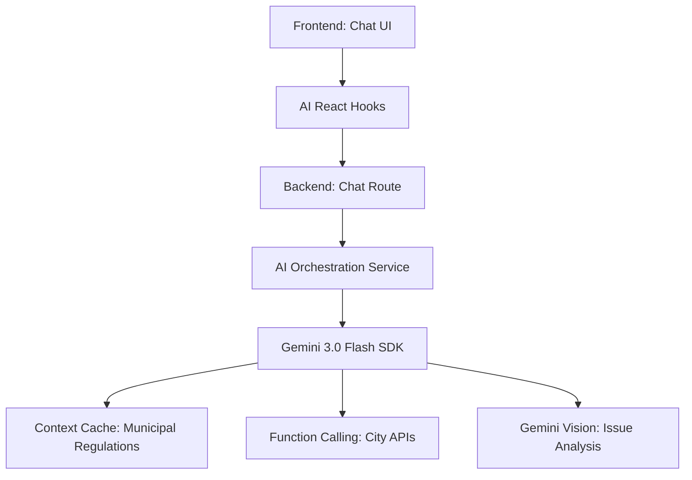
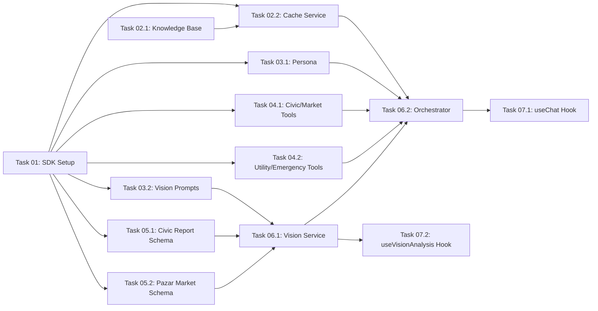

# Master Plan: AI Lane (Split Zmaj & Vision)

> **Objective:** Build a RAG-powered, vision-capable, and tool-augmented AI assistant for the City of Split.
> **North Star:** "One AI agent for Split: ask anything, report anything."

## 1. High-Level Architecture

## 2. Shared Data Contracts (app/src/types/index.ts)

| Type | Purpose | Status |
|---|---|---|
| `GeminiConfig` | Model configuration (temp, tokens, etc.) | ✅ Defined |
| `AIChatMessage` | Unified message format (role, content, tools) | ✅ Defined |
| `VisionReport` | Structured output from photo analysis | ✅ Defined |
| `ToolDeclaration` | Definitions for function calling | ✅ Defined |

## 3. Implementation Subtasks

| Task | Title | Priority | Model | Dependency |
|---|---|---|---|---|
| **T01** | Gemini SDK Setup | P0 | Flash | None |
| **T02.1** | Municipal Knowledge Base | P0 | Opus | None |
| **T02.2** | Gemini Cache Service | P0 | Pro High | T01, T02.1 |
| **T03.1** | Persona & Identity | P1 | Opus | T01 |
| **T03.2** | Vision Prompts & Builder | P1 | Pro High | T01 |
| **T04.1** | Civic & Market Tool Schemas | P1 | Flash | T01 |
| **T04.2** | Utility & Emergency Tool Schemas | P1 | Flash | T01 |
| **T05.1** | Civic Reporting Schema | P1 | Flash | T01 |
| **T05.2** | Pazar Market Schema | P1 | Flash | T01 |
| **T06.1** | Vision Service | P0 | Pro High | T01, T03.2, T05 |
| **T06.2** | Chat Orchestration Service | P0 | Opus | T02.2, T03.1, T04 |
| **T07.1** | useChat Hook | P1 | Pro High | T06.2 |
| **T07.2** | useVisionAnalysis Hook | P1 | Pro High | T06.1 |

## 4. Parallelization Guide

> Use **Antigravity Agent Manager** to run independent tasks simultaneously.

### Dependency Graph

### Execution Waves
| Wave | Tasks (Parallel) | Notes |
|---|---|---|
| Wave 1 | **Task 01, Task 02.1** | SDK + Content Foundation |
| Wave 2 | **Task 02.2, 03.1, 03.2, 04.1, 04.2, 05.1, 05.2** | Technical Logic Blocks |
| **Wave 3** | **Task 06.1** | Vision Integration |
| **Wave 4** | **Task 06.2** | Core Orchestration Integration |
| **Wave 5** | **Task 07.1, Task 07.2** | Frontend Bridges (Hooks) |

## 5. Agent Manager Instructions
1. Start **Task 01** and **Task 02.1** immediately.
2. Once both are done, spin up **4 agents** for Wave 2:
   - T02.2 (Pro High) - Cache logic
   - T03.1 (Opus) - Personality/Dialect
   - T03.2 (Pro High) - Vision/Builder
   - T04.1 (Flash) - Civic/Market tools
   - T04.2 (Flash) - Utility/Emergency tools
   - T05.1 (Flash) - Civic report schema
   - T05.2 (Flash) - Pazar market schema
3. When Wave 2 finishes, run **Task 06.1** (Pro High) for Vision.
4. Then run **Task 06.2** (Opus) to build the core orchestration.
5. Finally, run **Task 07.1** and **Task 07.2** (Pro High) to provide the React interface.
