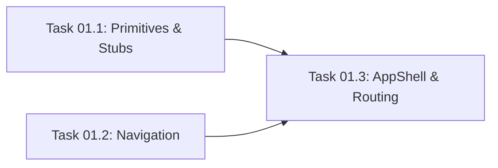

# Master Plan: App Shell + Layout

## High-Level Architecture
This feature implements the core layout and routing for the SplitAI application. The App Shell wraps all application pages and provides responsive navigation (Header on desktop, BottomNav on mobile). It also sets up React Router with lazy loading for all main pages.

## Shared Data Contracts
No new shared types are required for this phase. We will consume existing `SupportedLanguage` and `Theme` from `app/src/types/index.ts`.

## Subtasks
1. **Task 01.1: UI Primitives & Page Stubs**
   Create basic UI components (`Spinner`, `PageContainer`) and placeholder page components for all routes defined in the architecture.
2. **Task 01.2: Navigation Components**
   Build the `Header` and `BottomNav` layout components with responsive CSS.
3. **Task 01.3: AppShell & Routing**
   Combine navigation and routes into `AppShell`, update `App.tsx` with lazy-loaded routes and Suspense.

## Parallelization Guide

> Use **Antigravity Agent Manager** to run independent tasks simultaneously.
> Open one agent session per task in the same lane.

### Dependency Graph

### Execution Waves
| Wave | Tasks (run in parallel) | Model per Task | Notes |
|---|---|---|---|
| Wave 1 | Task 01.1, Task 01.2 | Pro High | No dependencies — start both immediately |
| Wave 2 | Task 01.3 | Pro High | Needs Task 01.1 and Task 01.2 output |

### Agent Manager Instructions
1. Open Agent Manager in Antigravity IDE
2. Start **2 agents** for Wave 1: one for Task 01.1, one for Task 01.2 (both Pro High)
3. Wait for both to complete
4. Start Task 01.3 with Pro High
