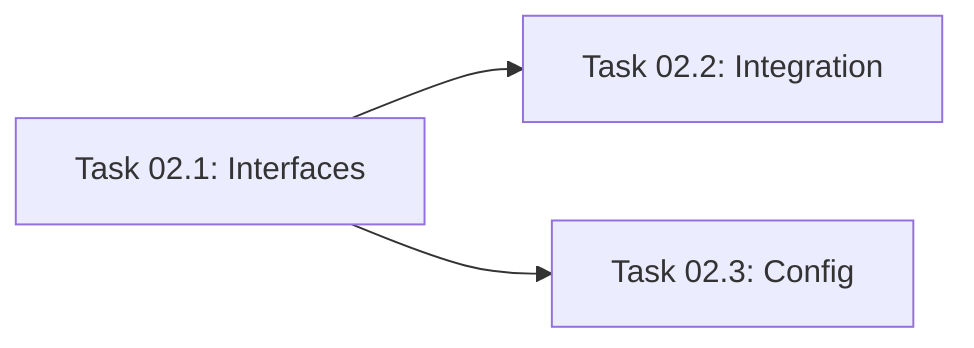

# Master Plan: Connect AI Services

This plan bridges the gap between the Backend API and the AI Logic (Gemini). It focuses on establishing a clean interface contract so that Backend and AI lanes can work in parallel.

## High-Level Architecture
The Backend routes will delegate business logic and AI processing to a dedicated `services/ai/` layer. This layer abstracts the Gemini API calls.

## Shared Data Contracts
We will use the types defined in `app/src/types/index.ts` for all service inputs and outputs.

## Subtasks
1. **Task 02.1: AI Service Interfaces & Stubs** - Create the directory structure and define the service classes/interfaces.
2. **Task 02.2: Route-to-Service Wiring** - Replace hardcoded mocks in routes with calls to the AI service layer.
3. **Task 02.3: Error Handling & Config** - Add global error handling for AI service failures and ensure environment variables are documented.

## Parallelization Guide

### Dependency Graph

### Execution Waves
| Wave | Tasks (run in parallel) | Model per Task | Notes |
|---|---|---|---|
| Wave 1 | Task 02.1 | Gemini 3.1 Pro High | Defines the contract for AI lane |
| Wave 2 | Task 02.2, Task 02.3 | Gemini 3.1 Pro High | Wiring the routes and setup config |

### Agent Manager Instructions
1. Start **Task 02.1** first.
2. Once the interfaces are defined, you can run **Task 02.2** and **Task 02.3** in parallel.
