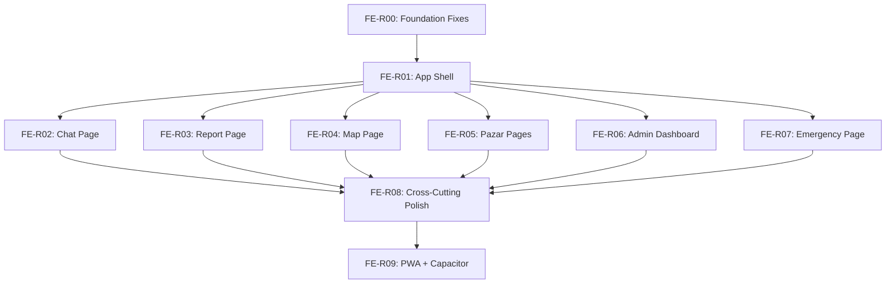

# MASTER PLAN — Frontend Overhaul

> **Owner:** Team Lead (Karlo) — Lane 1 (Frontend)
> **Branch:** `lane/frontend/overhaul`
> **Created:** 2026-05-16T14:40
> **Approach:** Interactive guided workflow (Aura.build components + Google Stitch views)

---

## Overview

Take over the sloppy frontend implementation (T01–T07) from the previous agent. Fix bugs, extract mock data, redesign each page using Aura.build components selected by the user, and optionally refine views with Google Stitch. Complete T08 (PWA + Capacitor).

## Architecture & Data Flow

No architectural changes. The existing data flow remains:

```
Page → Hook → Store ←→ Service → External API
  ↓       ↗
Component
```

All changes are **visual/structural** within `components/`, `pages/`, `styles/`, and `utils/`. No new types needed.

## Shared Contracts

No additions to `types/index.ts` required. All existing types are sufficient.

---

## Task List (Execution Order)

| # | Task | Phase | Type | Est. |
|---|---|---|---|---|
| FE-R00 | Foundation Fixes | 0 | 🤖 Agent solo | 15 min |
| FE-R01 | App Shell & Layout Overhaul | 1 | 🤝 Interactive (Aura) | 30 min |
| FE-R02 | Chat Page Redesign | 2 | 🤝 Interactive (Stitch/Aura) | 20 min |
| FE-R03 | Report Page Redesign | 2 | 🤝 Interactive (Aura) | 20 min |
| FE-R04 | Map Page Polish | 2 | 🤝 Interactive (Aura) | 15 min |
| FE-R05 | Pazar Pages Overhaul | 2 | 🤝 Interactive (Aura) | 20 min |
| FE-R06 | Admin Dashboard Polish | 2 | 🤝 Interactive (Aura) | 20 min |
| FE-R07 | Emergency Page Refactor | 2 | 🤝 Interactive (Aura) | 15 min |
| FE-R08 | Cross-Cutting Polish | 3 | 🤖 Agent solo | 15 min |
| FE-R09 | PWA + Responsive + Capacitor | 4 | 🤖 Agent solo | 15 min |

---

## Parallelization Guide

> This plan is **sequential by design** because it's interactive (user picks Aura components between tasks). No parallelization.

### Dependency Graph



### Execution Waves

| Wave | Tasks | Notes |
|---|---|---|
| Wave 1 | FE-R00 | Agent solo — no user input needed |
| Wave 2 | FE-R01 | User picks Aura header/nav components |
| Wave 3 | FE-R02 through FE-R07 | Sequential — user picks components per page |
| Wave 4 | FE-R08, FE-R09 | Agent solo — polish and PWA |

### Model Recommendations

All tasks should use **Opus 4.6** since the Team Lead is operating interactively and needs high-quality Aura→React conversions.

---

## Interactive Workflow Protocol

Each interactive task (FE-R01 through FE-R07) follows this loop:

1. **🤖 AGENT** does prep work (extract data, identify what needs replacing)
2. **⏸️ PAUSE** — Agent tells user exactly what to browse for on aura.build
3. **👤 USER** browses aura.build, picks a component, pastes HTML code
4. **🤖 AGENT** converts Aura HTML/Tailwind → React + tokens.css per `/aura-component` workflow
5. **👤 USER** reviews in browser, approves or requests tweaks
6. **🤖 AGENT** commits to branch

---

## Git Strategy

```
main ← (stable)
  └── lane/frontend/overhaul
        ├── fix(frontend): foundation fixes and mock data extraction
        ├── feat(frontend): premium app shell with Aura header/nav
        ├── feat(frontend): redesign chat page
        ├── feat(frontend): redesign report page
        ├── feat(frontend): polish map page overlays
        ├── feat(frontend): redesign pazar pages
        ├── feat(frontend): polish admin dashboard
        ├── feat(frontend): refactor emergency page
        ├── feat(frontend): responsive polish and micro-animations
        └── feat(frontend): PWA manifest and service worker
```

Final: squash-merge → `main`.

---

## Verification

After each commit:
- `npm run build` passes with zero errors
- Visual check in browser (mobile 375px + desktop 1440px)

Final:
- All routes navigable without console errors
- BottomNav works on mobile, Header nav on desktop
- Build succeeds
