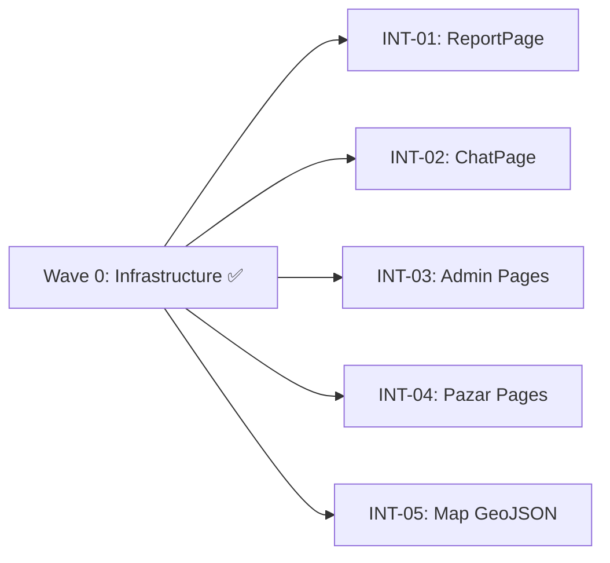

# MASTER PLAN — Frontend ↔ Backend Integration

> **Goal:** Wire all frontend pages from mock data to the real Express backend.
> **Time budget:** ~40 minutes remaining.
> **Priority:** ReportPage first (civic issue reporting), then Chat, then everything else.

## Architecture

```
Frontend (Vite :3000) → Vite Proxy /api/* → Backend (Express :3001)
```

### ✅ Infrastructure Already Done (Wave 0)
- [x] Vite proxy added to `vite.config.ts` — `/api/*` → `localhost:3001`
- [x] `dev:full` script added to `package.json` — runs both servers
- [x] `VITE_GEMINI_API_KEY` added to `.env`
- [x] Chat route fixed — now wraps response in `APIResponse<ChatResponse>`

### What Exists (No Changes Needed)
- `services/apiClient.ts` — `fetchApi()` with `API_BASE = localhost:3001`
- `services/chatService.ts`, `reportService.ts`, `pazarService.ts`, `adminService.ts` — all call correct endpoints
- `stores/useChatStore.ts`, `useReportStore.ts`, `usePazarStore.ts`, `useAdminStore.ts`, `useMapStore.ts` — all use services correctly
- `hooks/ai/useChat.ts`, `hooks/ai/useVisionAnalysis.ts` — call `/api/chat` and `/api/report/analyze`
- All backend routes: chat, report, pazar, admin, utilities

### What's Broken (The Gap)
Each page imports **mock data** (`mockChatData`, `mockReportData`, `mockPazarData`, `mockAdminData`, `MOCK_ISSUES`) instead of using the existing stores/hooks. Each task below fixes one page.

---

## Subtask List

| Task | File | Description | Priority | Est. |
|---|---|---|---|---|
| INT-01 | ReportPage.tsx | Wire to `useReportStore` (analyze + submit) | P0 | S |
| INT-02 | ChatPage.tsx | Wire to `useChatStore` | P0 | S |
| INT-03 | AdminDashboardPage.tsx + AdminReportsPage.tsx | Wire to `useAdminStore` | P1 | S |
| INT-04 | PazarFeedPage.tsx + PazarSubmitPage.tsx | Wire to `usePazarStore` + services | P1 | S |
| INT-05 | useIssueGeoJson.ts | Wire to `reportService.getReports()` | ✅ Done | S |

---

## Parallelization Guide

> Use **Antigravity Agent Manager** to run all 5 tasks simultaneously.
> Each task touches DIFFERENT files — zero conflict risk.

### Dependency Graph



### Execution Waves

| Wave | Tasks (run in parallel) | Model per Task | Notes |
|---|---|---|---|
| Wave 0 | Infrastructure | ✅ DONE | Proxy, env, chat route |
| Wave 1 | INT-01, INT-02, INT-03, INT-04, INT-05 | All Opus 4.6 | ALL independent — start all 5 simultaneously |

### Agent Manager Instructions
1. Open Agent Manager in Antigravity IDE
2. Start **5 agents** — one per task file
3. Each agent: `/execute Development_plans/Task_INT-0X_*.md`
4. All run in parallel (no dependencies between them)
5. When all complete, run `npm run build` to verify

---

## Shared Context for All Tasks

Every agent MUST know:
- **Backend is Express on port 3001** — already running via `npm run server`
- **Vite proxy is configured** — `/api/*` forwards to `:3001`
- **Do NOT modify**: `services/`, `stores/`, `hooks/ai/`, `server/`, `types/`
- **Only modify**: the specific page file(s) listed in the task
- **The stores and services already exist and work** — just use them
- **After your change, run `npm run build` to verify zero errors**

## Post-Integration Verification

After all 5 tasks complete:
1. Kill existing `npm run dev`
2. Run `npm run dev:full` (starts both Vite + Express)
3. Test each page in the browser
4. Check DevTools Network tab — all `/api/*` calls should return 200
