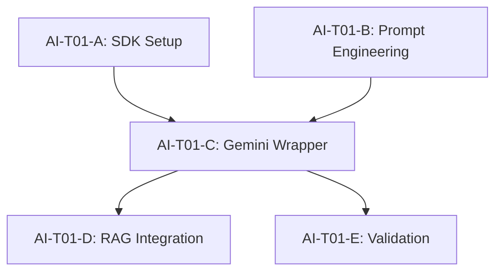

# Master Plan: RAG Service Implementation

This plan covers the implementation of the core AI service wrapper for the SplitAI project, specifically focusing on the Gemini-powered RAG service for municipal queries.

## 🏛️ Architecture & Data Flow
1. **Client/Backend Hook** calls `generateChatReply`.
2. **AI Service (`geminiText.ts`)** builds the full prompt:
   - System Persona ("Split Zmaj")
   - Injected Context (if RAG files provided)
   - Chat History
   - Current User Message
3. **Gemini Pro API** processes the request.
4. **AI Service** parses the response and citations.
5. **Result** returned as `ChatResponse`.

## 📄 Shared Data Contracts
Required in `app/src/types/index.ts` (verify if already present):
```typescript
export interface ChatMessage {
  role: 'user' | 'assistant' | 'system';
  content: string;
}

export interface ChatResponse {
  reply: string;
  citations: string[];
}
```

## 🛠️ Task Breakdown

### Wave 1: Foundation & API (Current)
| Task ID | Description | Model | Notes |
|---|---|---|---|
| AI-T01-A | **Setup SDK & Env**: Install `@google/generative-ai` and verify API keys. | Flash | No deps. |
| AI-T01-B | **Prompt Engineering**: Define "Split Zmaj" persona and citation format. | Pro High | No deps. |

### Wave 2: Implementation
| Task ID | Description | Model | Notes |
|---|---|---|---|
| AI-T01-C | **Gemini Wrapper**: Implement `generateChatReply` with history support. | Pro High | Needs SDK setup. |

### Wave 3: Integration & Testing
| Task ID | Description | Model | Notes |
|---|---|---|---|
| AI-T01-D | **RAG Context Integration**: Handle `contextFiles` injection into prompt. | Pro High | Needs Wrapper. |
| AI-T01-E | **Service Validation**: Unit tests for response parsing and citations. | Flash | Needs Wrapper. |

## 🗺️ Parallelization Guide


## 🤖 Model Recommendations
- **Gemini 3.1 Pro High**: For prompt engineering and core logic (T01-B, T01-C, T01-D).
- **Gemini 3.0 Flash**: For setup and testing (T01-A, T01-E).
