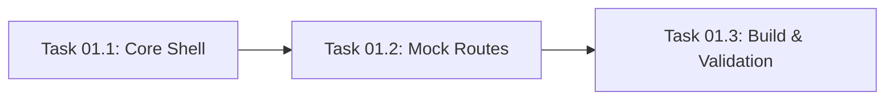

# Master Plan: Setup Server and Mocks

This plan breaks down the initial backend infrastructure and mock API implementation for SplitAI.

## High-Level Architecture
The backend is a Node.js/Express server located in `app/src/server/`. It provides a RESTful interface for the Frontend and acts as a proxy/orchestrator for AI services.

## Shared Data Contracts
All models are defined in `app/src/types/index.ts`. No new types are required for this phase.

## Subtasks
1. **Task 01.1: Server Core & Middleware** - Setup Express, global middleware, and file upload (Multer) configuration.
2. **Task 01.2: Mock Endpoints Implementation** - Create the chat, report creation, and report listing endpoints with static mock data.
3. **Task 01.3: Validation & Build** - Ensure the server starts, responds correctly to test requests, and passes the build step.

## Parallelization Guide

> Use **Antigravity Agent Manager** to run independent tasks simultaneously.

### Dependency Graph

### Execution Waves
| Wave | Tasks (run in parallel) | Model per Task | Notes |
|---|---|---|---|
| Wave 1 | Task 01.1 | Gemini 3.1 Pro High | Foundation for all other backend tasks |
| Wave 2 | Task 01.2 | Gemini 3.1 Pro High | Can start once 01.1 provides the express app shell |
| Wave 3 | Task 01.3 | Gemini 3.0 Flash | Final verification |

### Agent Manager Instructions
1. Start **Task 01.1** with Gemini 3.1 Pro High.
2. Once the server skeleton is in place, start **Task 01.2** in a second session to add route logic.
3. Finally, run **Task 01.3** to verify everything works together.
