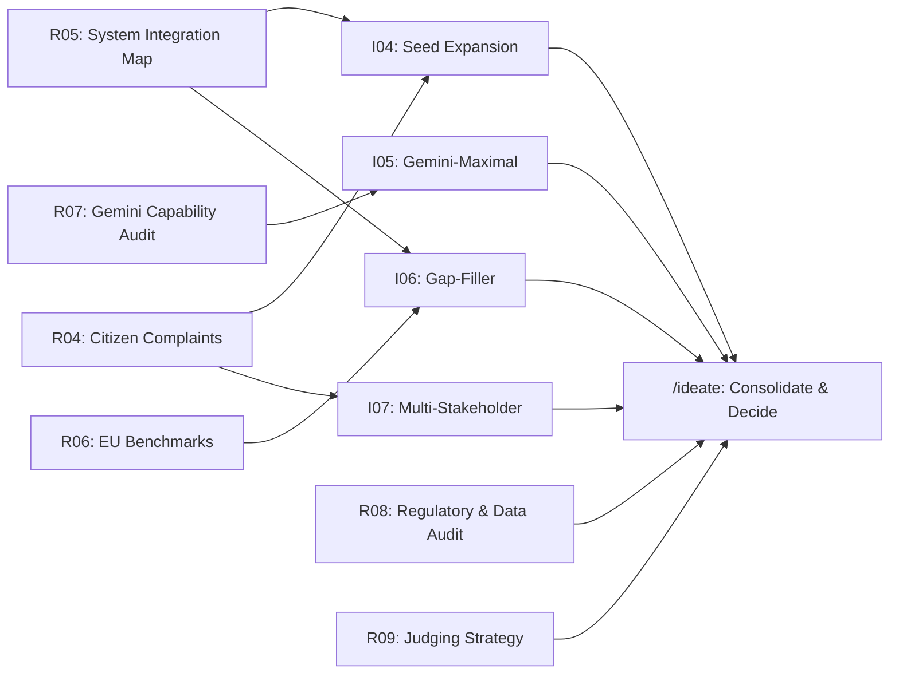

# Research & Ideation Plan — SplitAI Hackathon (Official Phase)

> **Created:** 2026-05-16 10:38 CET
> **Time Budget:** ~30 min for Wave 1 research, ~15 min for Wave 2 ideation, ~15 min for consolidation
> **Parallel Agents Available:** 4–5 (Antigravity Agent Manager)
> **Hackathon Theme:** City of Split (Grad Split)
> **Seed Idea:** SplitAI — Unified Municipal AI Agent (RAG + Vision) — see `docs/research/pre_hackathon_mock_idea_reference.md`

## Constraints

- **Theme:** City of Split — all solutions must serve Split's residents, tourists, or municipal operations
- **Judging Criteria:** (to be confirmed — assume standard: Innovation, Technical Execution, Business Viability, Demo Quality, AI Integration Depth)
- **Mandatory Tools/APIs:** Google AI tools (Gemini API, likely required by sponsor)
- **Seed Idea:** SplitAI concept exists — this research phase **validates, deepens, pivots, or expands** it based on real data
- **Pre-Research Status:** 3 research findings (R01–R03) and 3 ideation sprints (I01–I03) exist from mock phase — these are **starting points, not conclusions**. The new tasks go significantly deeper.

## What's Different This Time

The pre-hackathon research was broad and surface-level. This phase focuses on:

1. **Real resident/tourist voices** — not just statistics, but actual complaints, forum posts, social media sentiment
2. **Existing system deep-dives** — exact capabilities, APIs, data formats, integration points of Gradsko oko, Moj Split, Split Parking, Promet Split
3. **Modular architecture thinking** — how to build something that genuinely integrates with existing infrastructure, not just demos on top of mocks
4. **Competitor gap analysis** — what do other Croatian/EU cities do that Split doesn't?
5. **AI capability audit** — what can Gemini 2.5 actually do right now (multimodal, grounding, function calling) and how does that shape our MVP?

---

## Task Inventory

### Research Tasks (Deep, Evidence-Based)

| ID | Category | Title | Time Box | Model | Priority |
|---|---|---|---|---|---|
| R04 | R_MKT | Real Citizen & Tourist Complaints: Voice of the Street | 15 min | Gemini 3.1 Pro High | 🔴 Critical |
| R05 | R_TECH | Existing Municipal Systems: Deep Integration Map | 15 min | Gemini 3.1 Pro High | 🔴 Critical |
| R06 | R_COMP | EU Smart City Benchmarks & Competitor Solutions | 15 min | Gemini 3.1 Pro High | 🟡 High |
| R07 | R_TECH | Gemini AI Capability Audit for Municipal Use Cases | 12 min | Gemini 3.1 Pro High | 🔴 Critical |
| R08 | R_DOMAIN | Split Regulatory & Data Landscape: GUP, PDFs, Open Data Audit | 15 min | Gemini 3.1 Pro High | 🟡 High |
| R09 | R_RULE | Hackathon Judging Criteria & Winning Strategy Analysis | 10 min | Gemini 3.1 Pro High | 🟡 High |

### Ideation Sprints (Multi-Angle Creative Divergence)

| ID | Sprint Type | Angle | Time Box | Model | Depends On |
|---|---|---|---|---|---|
| I04 | I_SEED | Seed Expansion: 5 Variants of SplitAI | 12 min | Opus 4.6 (Thinking) | R04, R05 |
| I05 | I_TECH | Gemini-Maximal: What can ONLY AI do? | 12 min | Opus 4.6 (Thinking) | R07 |
| I06 | I_GAP | Gap-Filler: What's missing in Split's digital ecosystem? | 12 min | Opus 4.6 (Thinking) | R05, R06 |
| I07 | I_PERSONA | Multi-Stakeholder: Resident × Tourist × City Worker | 12 min | Opus 4.6 (Thinking) | R04 |

---

## Parallelization Guide

### Dependency Graph

### Execution Waves

| Wave | Tasks (run in parallel) | Agents Needed | Est. Time | Notes |
|---|---|---|---|---|
| **Wave 1** | R04, R05, R06, R07, R08, R09 | 4–6 | ~15 min | All research tasks — no dependencies between them |
| **Wave 2** | I04, I05, I06, I07 | 4 | ~12 min | Each depends on specific Wave 1 findings |
| **Wave 3** | `/ideate` (consolidation) | 1 (Team Lead) | ~15 min | Reads ALL findings, ranks ideas, makes final decision |

### Agent Manager Instructions

1. Open **Agent Manager** in Antigravity IDE
2. Start **up to 6 agents** for Wave 1 — one per research task
3. Each agent runs: `/research-execute Research/Tasks/<task_file>.md`
4. Wait for all Wave 1 agents to complete and verify findings exist in `Research/Findings/`
5. Start **4 agents** for Wave 2 — one per ideation sprint
6. Each agent runs: `/research-execute Research/Tasks/<task_file>.md`
7. Once ALL findings are in `Research/Findings/`, Team Lead runs: `/ideate`

---

## Methodology Notes

### Why This Research Matters

The pre-hackathon research identified broad themes (housing crisis, traffic, waste, tourism friction) but lacked:
- **Primary source validation** — actual citizen complaints from forums, Reddit, social media
- **System-level integration analysis** — exact API endpoints, data formats, existing workflows
- **Competitive landscape** — what other cities solved these problems and how
- **Technology constraint mapping** — what Gemini can actually do vs. what we assume it can

### Research Quality Standards

Each research task must:
1. **Cite primary sources** (actual URLs, not just "Slobodna Dalmacija says...")
2. **Include quantitative data** where possible (complaint counts, response times, user numbers)
3. **Identify integration hooks** — exact APIs, data formats, or existing workflows we can plug into
4. **Flag risks and unknowns** — what we couldn't verify and why it matters
5. **End with actionable "So What?"** — clear implications for what we should build

### Ideation Quality Standards

Each ideation sprint must:
1. **Produce 4–5 distinct ideas** (not slight variations of the same thing)
2. **Score each on 5 dimensions**: Feasibility (1–5), Demo-ability (1–5), AI Depth (1–5), City Alignment (1–5), Uniqueness (1–5)
3. **Identify "killer demo moments"** — the 10-second clip that would make a judge say "wow"
4. **Consider modular architecture** — can this integrate with existing city systems? Can it expand later?
5. **Note cross-pollination** — which ideas from different sprints could combine?
