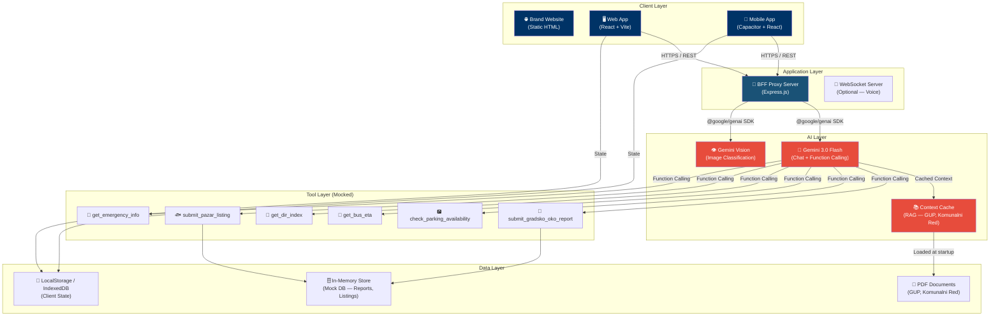
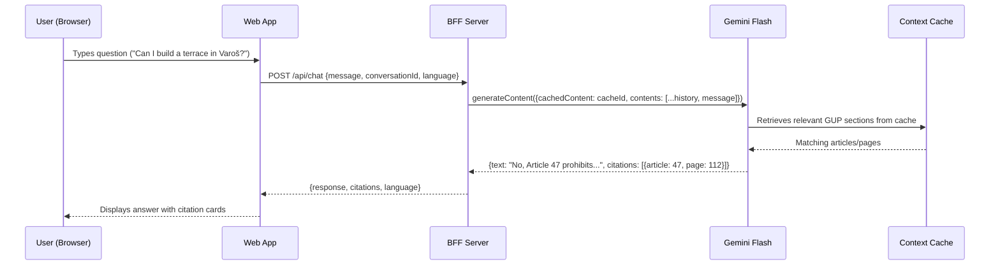
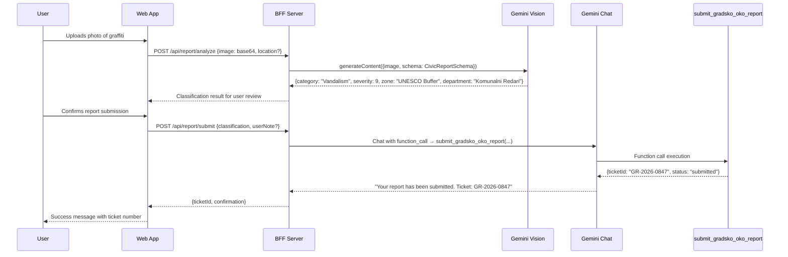
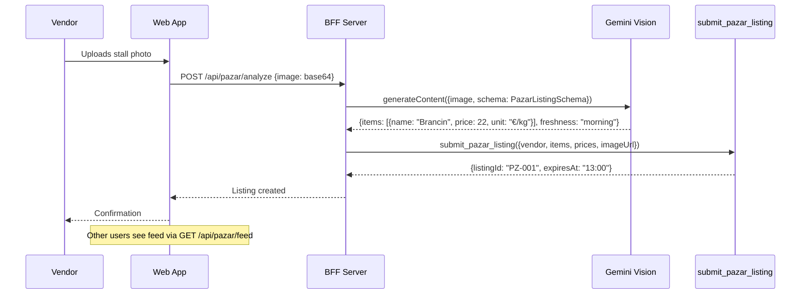
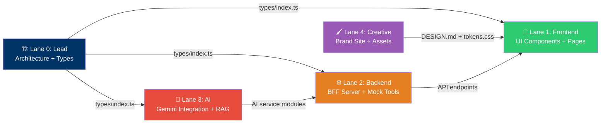
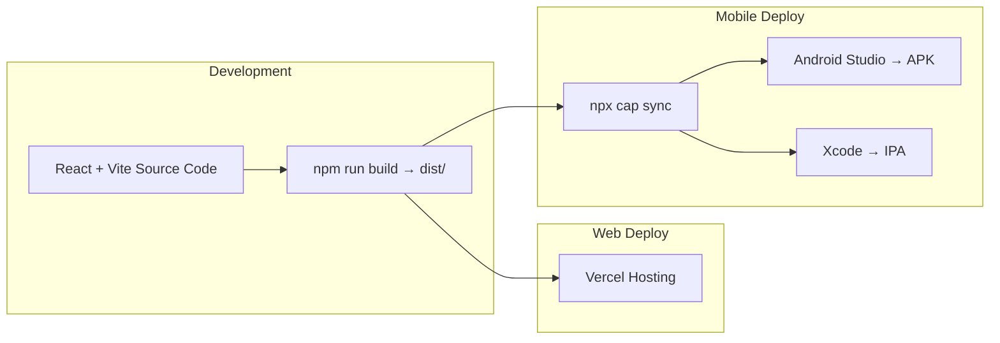

# SplitAI — System Architecture

> **Version:** 2.1 (Gemini 3.0 Flash + Capacitor Native Mobile)
> **Last Updated:** 2026-05-16T11:35:00+02:00
> **Author:** Lead Agent (Lane 0)

---

## 1. System Overview

SplitAI is a **Unified Municipal AI Agent** for the City of Split. It provides a single conversational interface that routes citizen and tourist requests to specialized AI capabilities: RAG-powered regulation Q&A, Vision-based civic issue reporting, a daily Pazar market feed, and multilingual chat — all backed by Gemini 3.0 Flash.

The system comprises **four deliverables**:

| Deliverable | Technology | Purpose | Priority |
|---|---|---|---|
| **Brand Website** | Static HTML/CSS (Aura template) | Marketing landing page, visual north star | Wave 1 |
| **Web Application** | React 19 + Vite + TypeScript | Primary product: chat UI, photo reporting, admin dashboard | Wave 2–5 |
| **Native Mobile App** | Capacitor (wraps React app) | Android/iOS native app — same codebase as web app | Wave 6 |
| **BFF Server** | Express.js (Node.js) | API proxy protecting Gemini key, serving mock tools | Wave 2 |

> **Mobile Strategy:** The web app is built first as a responsive PWA. Once the web app is feature-complete, **Capacitor** wraps the same Vite build output into native Android/iOS apps with zero code changes. Capacitor provides access to native APIs (Camera, GPS, Push Notifications, Haptics) via plugins. This gives us a real native app in the app store while sharing 100% of the React codebase.
>
> **Why Capacitor over Tauri:** Capacitor is purpose-built for web→mobile. It has mature iOS/Android support, official camera/GPS plugins, and requires no Rust toolchain. Tauri's mobile support is newer and less battle-tested for hackathon timelines.

---

## 2. High-Level Architecture



---

## 3. Component Responsibilities

### 3.1 Client Layer

| Component | Tech | Responsibility |
|---|---|---|
| **Brand Website** | Static HTML/CSS/JS | Marketing page for judges. Showcases product vision, screenshots, team. Deployed to Vercel. |
| **Web App** | React 19 + Vite + TS + Zustand | Primary product. Contains all user-facing features: Chat, Photo Reporting, Pazar Feed, Admin Dashboard. Responsive, works as PWA too. |
| **Mobile App** | Capacitor wrapping the React app | Native Android/iOS app. Same codebase as web app. Access to Camera, GPS, Push Notifications, Haptics via Capacitor plugins. Built after web app is feature-complete. |

### 3.2 Application Layer (BFF)

| Component | Tech | Responsibility |
|---|---|---|
| **BFF Proxy** | Express.js (Node.js) | Protects Gemini API key. Routes client requests to Gemini SDK. Handles file uploads (base64 images). Manages Context Cache lifecycle. Serves mock tool responses. |
| **WebSocket Server** | ws (optional) | Real-time voice streaming if voice input is implemented (nice-to-have). |

### 3.3 AI Layer

| Component | Tech | Responsibility |
|---|---|---|
| **Gemini Chat** | `gemini-3.0-flash` | Main conversational engine. Receives user messages + system prompt. Uses function calling to route requests to the correct tool. Multilingual by default. |
| **Gemini Vision** | `gemini-3.0-flash` (multimodal) | Receives base64 images. Returns structured JSON classification (issue type, severity, location, department). Used for both civic reports and Pazar listings. |
| **Context Cache** | `createCachedContent()` | Pre-loads GUP (250+ pages), Komunalni Red, and Emergency Protocols into Gemini's context window. All RAG queries use this cached context for instant retrieval without vector DB. |

### 3.4 Tool Layer (Function Calling)

All tools are **mocked server-side functions** that Gemini invokes via structured function calling. They return realistic demo data.

| Tool Name | Input | Output | Mock Behavior |
|---|---|---|---|
| `submit_gradsko_oko_report` | `{category, severity, location, description, imageUrl}` | `{ticketId, status, eta}` | Generates ticket ID, stores in memory, returns confirmation |
| `check_parking_availability` | `{zone, vehicleType}` | `{available, zones[], price, nearestGarage}` | Returns hardcoded Split parking zone data |
| `get_bus_eta` | `{lineNumber, stopName}` | `{eta, nextBuses[], alerts}` | Returns mock Promet Split schedule |
| `get_dir_index` | `{area}` | `{crowdLevel, suggestion, alternateRoute}` | Returns mock crowd data for Diocletian's Palace area |
| `submit_pazar_listing` | `{vendor, items[], prices[], imageUrl}` | `{listingId, expiresAt}` | Stores listing in memory, sets 4h expiry |
| `get_emergency_info` | `{alertType, language}` | `{instructions, safetyTips, contacts}` | Returns translated emergency protocols |

### 3.5 Data Layer

| Store | Tech | Purpose |
|---|---|---|
| **PDF Documents** | Static files on server | Source documents for RAG: GUP, Komunalni Red, Emergency Protocols |
| **In-Memory Store** | Node.js Map/Array | Mock database for reports, Pazar listings, admin queue |
| **Client State** | Zustand + LocalStorage | Chat history, user preferences (language, theme), PWA offline state |

---

## 4. Data Flow Diagrams

### 4.1 Chat Flow (RAG Q&A)



### 4.2 Photo Report Flow (Vision AI)



### 4.3 Pazar Feed Flow



---

## 5. API Endpoint Catalog

### 5.1 Chat Endpoints

| Method | Path | Request Body | Response | Auth |
|---|---|---|---|---|
| `POST` | `/api/chat` | `{message: string, conversationId?: string, language?: string}` | `ChatResponse` | None (demo) |
| `GET` | `/api/chat/history/:conversationId` | — | `ChatMessage[]` | None |

### 5.2 Report Endpoints

| Method | Path | Request Body | Response | Auth |
|---|---|---|---|---|
| `POST` | `/api/report/analyze` | `{image: string (base64), location?: GeoLocation}` | `CivicReportClassification` | None |
| `POST` | `/api/report/submit` | `{classification: CivicReportClassification, userNote?: string}` | `{ticketId: string, status: string}` | None |
| `GET` | `/api/reports` | Query: `?status=&severity=&department=` | `CivicReport[]` | Admin |

### 5.3 Pazar Feed Endpoints

| Method | Path | Request Body | Response | Auth |
|---|---|---|---|---|
| `POST` | `/api/pazar/analyze` | `{image: string (base64)}` | `PazarListingClassification` | None |
| `POST` | `/api/pazar/submit` | `{classification: PazarListingClassification, vendor: string}` | `{listingId: string}` | None |
| `GET` | `/api/pazar/feed` | Query: `?active=true` | `PazarListing[]` | None |

### 5.4 Utility Endpoints

| Method | Path | Request Body | Response | Auth |
|---|---|---|---|---|
| `GET` | `/api/emergency/:type` | Query: `?lang=de` | `EmergencyInfo` | None |
| `GET` | `/api/parking/:zone` | — | `ParkingInfo` | None |
| `GET` | `/api/transit/:line` | — | `TransitInfo` | None |
| `GET` | `/api/crowd/:area` | — | `CrowdInfo` (Đir Index) | None |

### 5.5 Admin Endpoints

| Method | Path | Request Body | Response | Auth |
|---|---|---|---|---|
| `GET` | `/api/admin/dashboard` | — | `AdminDashboardData` | Admin |
| `PATCH` | `/api/admin/reports/:id` | `{status: string, assignedTo?: string}` | `CivicReport` | Admin |

### 5.6 System Endpoints

| Method | Path | Request Body | Response | Auth |
|---|---|---|---|---|
| `POST` | `/api/cache/init` | — | `{cacheId: string, status: string}` | Internal |
| `GET` | `/api/health` | — | `{status: "ok", cacheReady: boolean}` | None |

---

## 6. Frontend View Architecture

### 6.1 Route Map

```
/                     → Landing / Chat (default view)
/chat                 → Full chat interface (SplitAI agent)
/report               → Photo reporting flow
/pazar                → Pazar market feed (public view)
/pazar/submit         → Vendor photo upload
/emergency            → Emergency info / QR scanner
/admin                → Admin triage dashboard
/admin/reports        → Report management
/admin/analytics      → Analytics overview
```

### 6.2 Page Components

| Route | Page Component | Key Features |
|---|---|---|
| `/` or `/chat` | `ChatPage` | Conversational UI, message bubbles, citation cards, language auto-detect, suggested prompts |
| `/report` | `ReportPage` | Camera/upload, AI classification preview, confirm & submit flow, ticket confirmation |
| `/pazar` | `PazarFeedPage` | Scrollable product cards, price display, freshness indicators, vendor info |
| `/pazar/submit` | `PazarSubmitPage` | Vendor photo upload, AI-extracted listing preview, edit & confirm |
| `/emergency` | `EmergencyPage` | QR scanner, multilingual emergency instructions, contact info |
| `/admin` | `AdminDashboardPage` | Report summary cards, severity heatmap, department filters |
| `/admin/reports` | `AdminReportsPage` | Report table with status management, deduplication view |

### 6.3 Shared Layout

```
┌──────────────────────────────────────────────────┐
│  Header: SplitAI Logo │ Nav Tabs │ Lang │ Theme  │
├──────────────────────────────────────────────────┤
│                                                  │
│                  Page Content                    │
│                  (via Outlet)                    │
│                                                  │
├──────────────────────────────────────────────────┤
│  Bottom Nav (mobile): Chat │ Report │ Pazar │ ⚙️  │
└──────────────────────────────────────────────────┘
```

---

## 7. State Management Architecture

### 7.1 Zustand Stores

| Store | Scope | Key State | Persistence |
|---|---|---|---|
| `useChatStore` | Chat feature | `messages[]`, `conversationId`, `isStreaming`, `suggestedPrompts` | LocalStorage (history) |
| `useReportStore` | Report feature | `currentImage`, `classification`, `submissionStatus`, `recentReports[]` | None |
| `usePazarStore` | Pazar feature | `listings[]`, `isLoading`, `filters` | None |
| `useAdminStore` | Admin feature | `reports[]`, `dashboardStats`, `filters`, `selectedReport` | None |
| `useAppStore` | Global | `language`, `theme`, `isOnline`, `cacheStatus` | LocalStorage |

---

## 8. AI System Prompt Architecture

### 8.1 System Prompt Structure

```
[IDENTITY] You are "Split Zmaj" — the AI assistant for the City of Split...
[CAPABILITIES] You can: answer regulation questions, classify civic issues from photos, provide transit/parking info, show Pazar market prices, give emergency instructions...
[TOOLS] Available function calls: submit_gradsko_oko_report, check_parking, get_bus_eta, get_dir_index, submit_pazar_listing, get_emergency_info
[RAG CONTEXT] The following municipal documents are loaded: GUP (General Urbanistic Plan), Komunalni Red, Emergency Protocols...
[BEHAVIOR] Always cite source articles. Auto-detect language. Be warm but efficient. Use Dalmatian expressions when speaking Croatian.
[OUTPUT] Respond in the user's detected language. Include citations as structured objects.
```

### 8.2 Vision Prompt Templates

| Use Case | Prompt Template | Output Schema |
|---|---|---|
| Civic Report | "Classify this urban issue photo..." | `CivicReportClassification` |
| Pazar Listing | "Identify produce/fish items and prices..." | `PazarListingClassification` |
| Emergency QR | "Extract emergency type from QR context..." | `EmergencyInfo` |

---

## 9. Lane Responsibility Matrix

### 9.1 Lane Ownership

| Lane | Produces | Consumes | Handoff Points |
|---|---|---|---|
| **Lane 0: Lead** | Architecture docs, type contracts, MASTER_PLAN, task delegation | Selected idea, research | Delivers types → All lanes. Delivers task files → All lanes. |
| **Lane 1: Frontend** | React pages, components, layouts, styles, responsive web + Capacitor native mobile | Types, design tokens, mock API responses | Delivers UI → Integration. Delivers Capacitor build → Mobile. Consumes API contracts from Backend. |
| **Lane 2: Backend** | Express BFF server, API routes, mock tools, in-memory store | Types, AI service interfaces | Delivers running server → Integration. Delivers API endpoints → Frontend. |
| **Lane 3: AI** | Gemini SDK integration, prompt engineering, RAG setup, Vision schemas | Types, PDF documents | Delivers AI service modules → Backend integration. |
| **Lane 4: Creative** | Brand website, design tokens, assets (icons, images), pitch deck | Selected idea, architecture | Delivers DESIGN.md + tokens.css → All lanes. Delivers brand site → Vercel. |

### 9.2 Lane Dependency Graph



### 9.3 Blocking Dependencies

| Blocked Lane | Blocked On | What's Needed | Unblock Strategy |
|---|---|---|---|
| Frontend | Creative (tokens.css) | Design tokens for styling | Frontend can start with temporary tokens; replace when Creative delivers |
| Frontend | Backend (API) | Working API endpoints | Frontend uses mock service layer with hardcoded responses; swap at integration |
| Backend | AI (services) | Gemini SDK integration code | Backend stubs AI service calls; AI lane delivers modules that drop in |
| All | Lead (types) | Type contracts | **Lead delivers first** — unblocks all lanes |

---

## 10. Technology Stack Summary

### 10.1 Frontend

| Concern | Technology | Rationale |
|---|---|---|
| Framework | React 19 + TypeScript | Already scaffolded, team expertise |
| Build | Vite 6 | Fast HMR, instant dev startup |
| Routing | react-router-dom v7 | Already installed |
| State | Zustand 5 | Minimal boilerplate, good DevTools |
| Styling | Vanilla CSS + tokens.css | Max control, design token system |
| Icons | Lucide React | Already installed, consistent style |
| i18n | i18next + react-i18next | Already installed, runtime language switching |
| PWA | vite-plugin-pwa | Add-to-home-screen, offline shell |
| Native Mobile | @capacitor/core + @capacitor/cli | Wraps Vite build into Android/iOS native app |
| Native Camera | @capacitor/camera | Native camera access for photo reporting |
| Native GPS | @capacitor/geolocation | Native location for report geo-tagging |
| Native Push | @capacitor/push-notifications | Push notifications for report status updates |

### 10.2 Backend

| Concern | Technology | Rationale |
|---|---|---|
| Runtime | Node.js 20+ | Same language as frontend |
| Framework | Express.js | Lightweight, fast to set up |
| AI SDK | @google/genai (TypeScript) | Official Gemini SDK |
| File Handling | multer | Image upload processing |
| CORS | cors middleware | Frontend↔Backend communication |
| Environment | dotenv | API key management |

### 10.3 AI

| Concern | Technology | Rationale |
|---|---|---|
| Model | gemini-3.0-flash | Latest model, improved speed + multilingual + vision capabilities |
| RAG | Context Caching API | No vector DB needed, native Gemini feature |
| Vision | Gemini multimodal input | Same model, image + text → structured JSON |
| Function Calling | Gemini tool declarations | Structured routing to mock city services |
| Output | responseSchema (Zod) | Deterministic JSON outputs |

### 10.4 Infrastructure

| Concern | Technology | Rationale |
|---|---|---|
| Web App Hosting | Vercel | Free tier, instant deploys |
| Brand Site Hosting | Vercel | Separate project, same platform |
| API Hosting | Vercel Serverless or Railway | Serverless functions or lightweight container |
| Domain | Vercel subdomains | Free, instant |
| CI/CD | Git push → Vercel auto-deploy | Zero config |

---

## 11. Project Directory Structure (Target State)

```
SplitAI/
├── app/                          # Web + Mobile Application (React + Vite + Capacitor)
│   ├── src/
│   │   ├── assets/images/        # Static imported assets
│   │   ├── components/
│   │   │   ├── ui/               # Button, Input, Badge, Card, Spinner, Modal
│   │   │   ├── layout/           # AppShell, Header, BottomNav, PageContainer
│   │   │   ├── chat/             # ChatBubble, ChatInput, CitationCard, SuggestedPrompts
│   │   │   ├── report/           # PhotoUpload, ClassificationPreview, TicketConfirmation
│   │   │   ├── pazar/            # ProductCard, PazarGrid, VendorUpload
│   │   │   ├── admin/            # ReportTable, SeverityBadge, DashboardMetric, RouteMap
│   │   │   └── emergency/        # QRScanner, EmergencyCard
│   │   ├── hooks/
│   │   │   └── ai/               # useChat, useVisionAnalysis, useRAG
│   │   ├── i18n/
│   │   │   ├── config.ts
│   │   │   └── locales/          # en.json, hr.json, de.json, it.json, fr.json
│   │   ├── lib/
│   │   │   └── ai/               # geminiClient, promptTemplates, schemas
│   │   ├── middleware/            # authGuard (admin routes)
│   │   ├── pages/                # ChatPage, ReportPage, PazarFeedPage, AdminDashboard, etc.
│   │   ├── services/
│   │   │   ├── ai/               # geminiService, cacheService, visionService
│   │   │   ├── chatService.ts
│   │   │   ├── reportService.ts
│   │   │   ├── pazarService.ts
│   │   │   └── adminService.ts
│   │   ├── server/               # Express BFF (or Vercel serverless functions)
│   │   │   ├── index.ts          # Server entry point
│   │   │   ├── routes/           # chat.ts, report.ts, pazar.ts, admin.ts, emergency.ts
│   │   │   ├── tools/            # Mock tool implementations
│   │   │   └── cache/            # Context cache initialization
│   │   ├── stores/               # useChatStore, useReportStore, usePazarStore, useAdminStore, useAppStore
│   │   ├── styles/
│   │   │   └── tokens.css        # Design system tokens
│   │   ├── types/
│   │   │   └── index.ts          # ALL shared type contracts
│   │   └── utils/                # formatDate, slugify, truncate, etc.
│   ├── public/
│   │   ├── assets/               # Large static files (PDFs, icons)
│   │   ├── manifest.json         # PWA manifest
│   │   └── sw.js                 # Service worker (PWA)
│   ├── android/                  # Capacitor Android project (auto-generated)
│   ├── ios/                      # Capacitor iOS project (auto-generated)
│   ├── capacitor.config.ts       # Capacitor configuration
│   └── package.json
├── brand_site/                   # Branding Website (Static HTML)
├── assets/                       # Raw creative assets
├── docs/
│   ├── architecture/             # This file + diagrams
│   ├── research/                 # Research findings
│   ├── design/                   # Design specs
│   ├── pitch/                    # Pitch materials
│   └── demo/                     # Demo scripts
├── Development_plans/            # Task files, state tracking
├── Decisions/                    # Idea selection, brand decisions
└── Research/                     # Research task outputs
```

---

## 11.1 Capacitor Mobile Architecture

### How It Works



### Capacitor Setup Steps (for Frontend lane)

1. `npm install @capacitor/core @capacitor/cli`
2. `npx cap init "SplitAI" "com.splitai.app" --web-dir dist`
3. `npm install @capacitor/camera @capacitor/geolocation @capacitor/push-notifications @capacitor/haptics`
4. `npx cap add android`
5. `npx cap add ios` (if macOS available)
6. After each web build: `npm run build && npx cap sync`
7. Open in Android Studio: `npx cap open android`

### Native Plugin Usage

Capacitor plugins expose native APIs that work identically on web (via fallback) and native:

```typescript
// Works on both web and native — Capacitor auto-selects the right implementation
import { Camera, CameraResultType } from '@capacitor/camera';
import { Geolocation } from '@capacitor/geolocation';

// Take a photo (uses native camera on mobile, file picker on web)
const photo = await Camera.getPhoto({ resultType: CameraResultType.Base64 });

// Get GPS location (uses native GPS on mobile, browser API on web)
const position = await Geolocation.getCurrentPosition();
```

### Key Decisions

| Concern | Decision | Rationale |
|---|---|---|
| Shared codebase | 100% shared React code | Zero duplication, single source of truth |
| Native camera | @capacitor/camera | Better UX than HTML file input on mobile |
| Native GPS | @capacitor/geolocation | More accurate than browser geolocation API |
| Push notifications | @capacitor/push-notifications | Real native push for report status updates |
| Haptic feedback | @capacitor/haptics | Tactile response on report submission |
| Build priority | Web first → Mobile after CP2 | Web must work for demo; mobile is a bonus |
| Demo target | Android APK (easier to demo) | No Apple Developer account needed |

---

## 12. Security Architecture

| Concern | Approach |
|---|---|
| API Key Protection | Gemini key stored in `.env`, accessed only by BFF server. Never sent to client. |
| Client→Server Auth | None for demo (all endpoints public). Admin routes use simple token/query param for demo. |
| Input Sanitization | All user text sanitized before Gemini calls. Image size limited to 5MB. |
| Rate Limiting | Simple in-memory counter per IP. Prevents abuse during demo. |
| CORS | Restricted to app domain only. |
| Content Security | Gemini safety filters enabled. Inappropriate content rejected. |

---

## 13. Performance Targets

| Metric | Target | Strategy |
|---|---|---|
| Chat response (text) | < 1s | Gemini 3.0 Flash + Context Cache pre-warmed |
| Vision classification | < 2s | Single API call with responseSchema |
| Page load (first paint) | < 1.5s | Vite code splitting + lazy routes |
| Mobile app startup | < 2s | Capacitor WebView pre-loaded |
| PWA install | Works offline | Service worker caches shell |
| Concurrent users | 10+ (demo) | In-memory store, no DB bottleneck |

---

## 14. Critical Path (Demo-Ready Order)

```mermaid
gantt
    title SplitAI Critical Path
    dateFormat HH:mm
    axisFormat %H:%M

    section Foundation
    Architecture + Types       :done, arch, 10:30, 1h
    Brand Site + Design Tokens :crit, brand, 11:00, 1.5h
    BFF Server Scaffold        :crit, bff, 11:30, 1h

    section Core AI
    Gemini SDK Setup           :crit, sdk, 11:30, 1h
    RAG Context Cache          :crit, rag, 12:30, 1.5h
    Vision Schema + Prompts    :crit, vis, 12:30, 1h

    section Core UI
    Chat UI                    :crit, chat, 12:30, 2h
    Photo Report Flow          :crit, report, 14:30, 1.5h

    section Integration
    CP1: Chat + RAG E2E        :milestone, cp1, 14:00, 0
    CP2: Report + Vision E2E   :milestone, cp2, 17:00, 0

    section Polish
    Pazar Feed                 :pazar, 15:00, 1.5h
    Admin Dashboard            :admin, 16:00, 2h
    Emergency / QR             :emerg, 17:00, 1h
    Capacitor Mobile Build     :mobile, 17:30, 1h
    Demo Rehearsal             :demo, 18:00, 0.5h
    CP3: Final Integration     :milestone, cp3, 18:30, 0
```
